# 附录：思维导图

> 使用 [Mermaid](https://mermaid.js.org/) 语法制作，支持 GitHub 原生渲染。

---

## 1. MySQL 整体架构图

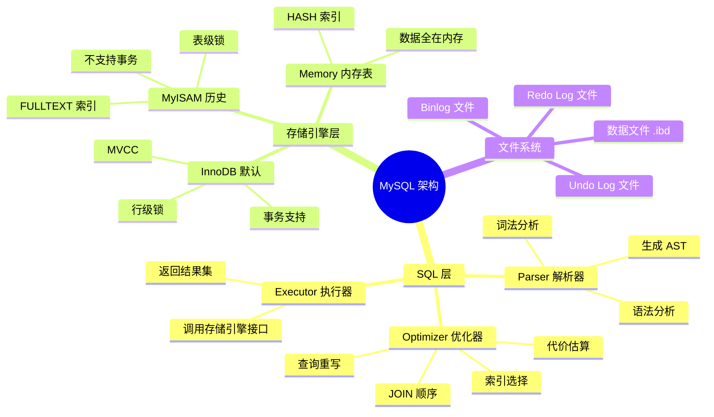

---

## 2. 数据结构到 B+Tree 推导链路

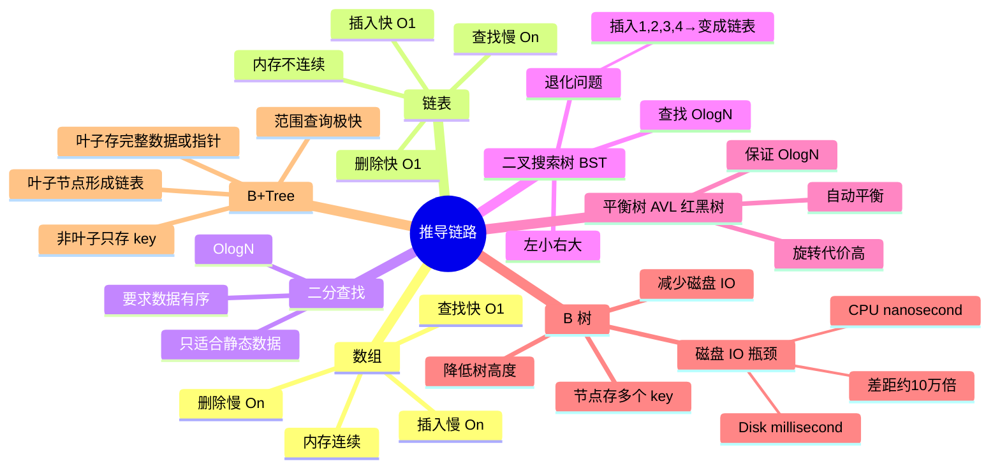

---

## 3. 存储引擎核心：磁盘 → Page → Buffer Pool

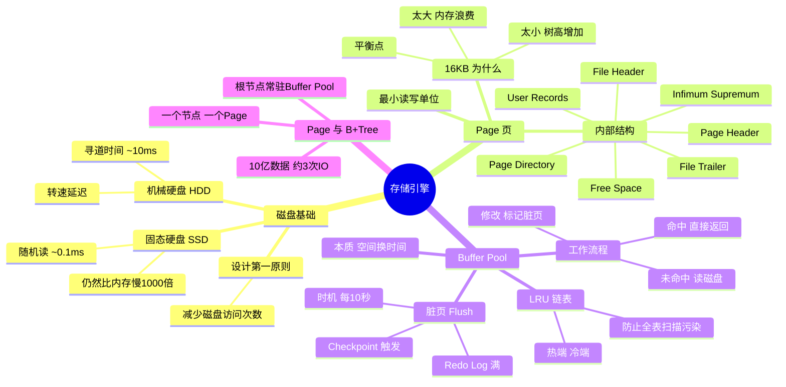

---

## 4. 索引体系全景

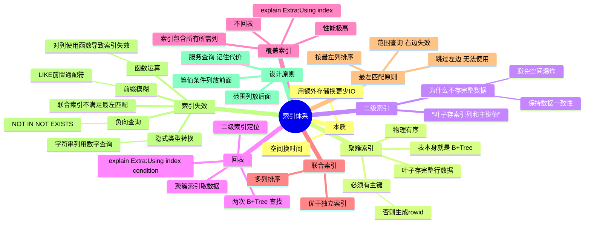

---

## 5. 事务 & Redo/Undo 关系

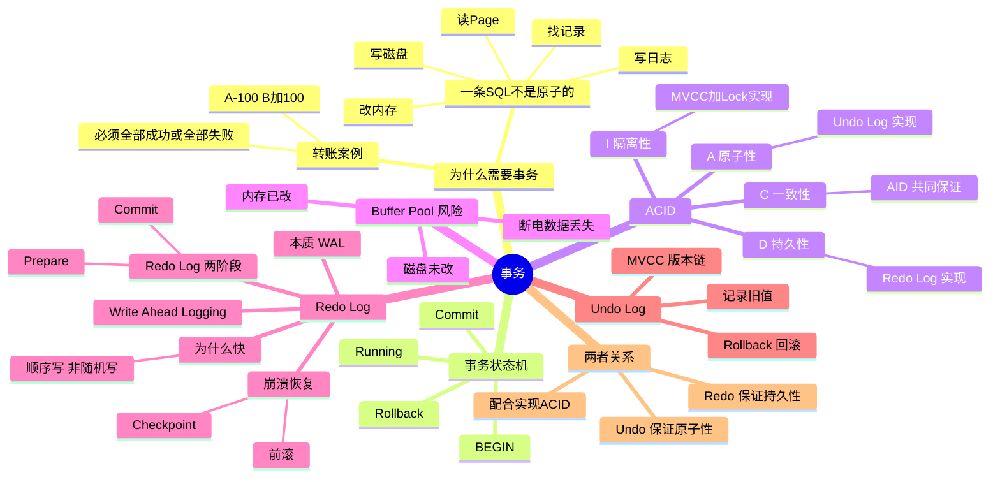

---

## 6. MVCC 版本链 & ReadView

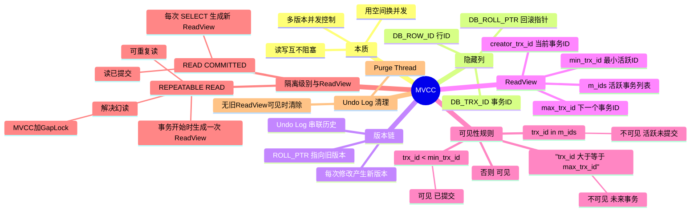

---

## 7. 锁体系

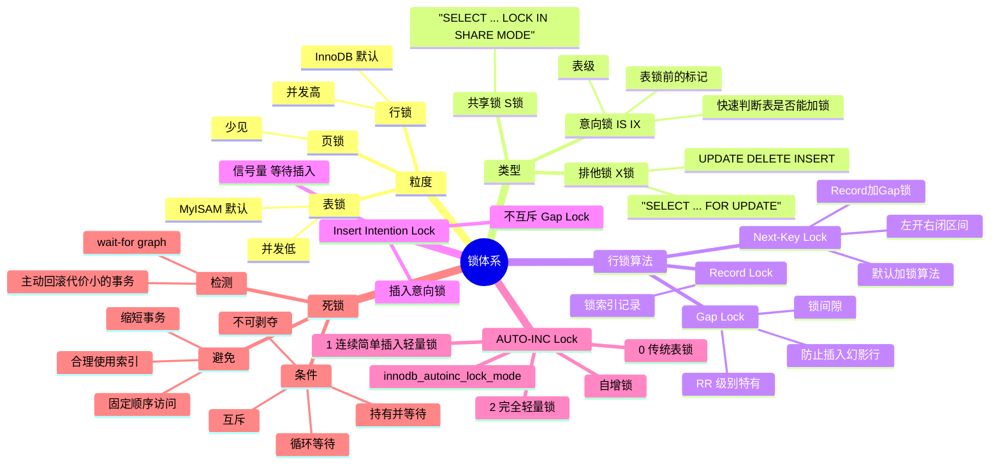

---

## 8. SQL 生命周期 & EXPLAIN

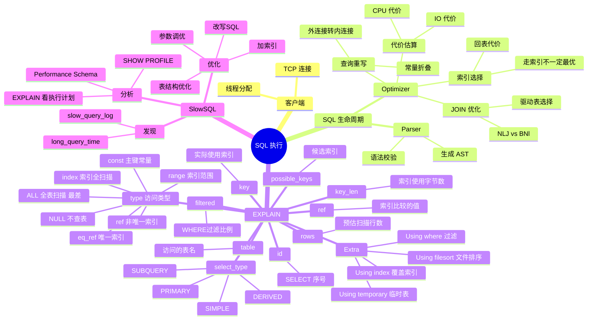

---

## 9. InnoDB 内核全景

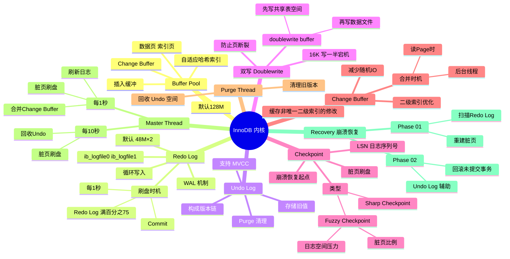

---

## 10. 领域视角总览

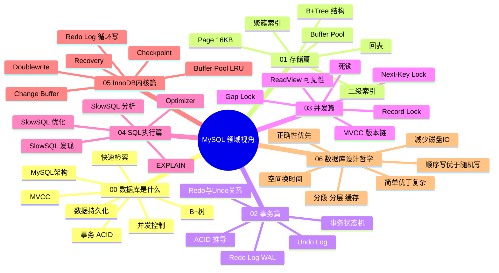

---

## 11. 推导链 vs 领域视角 双翼图

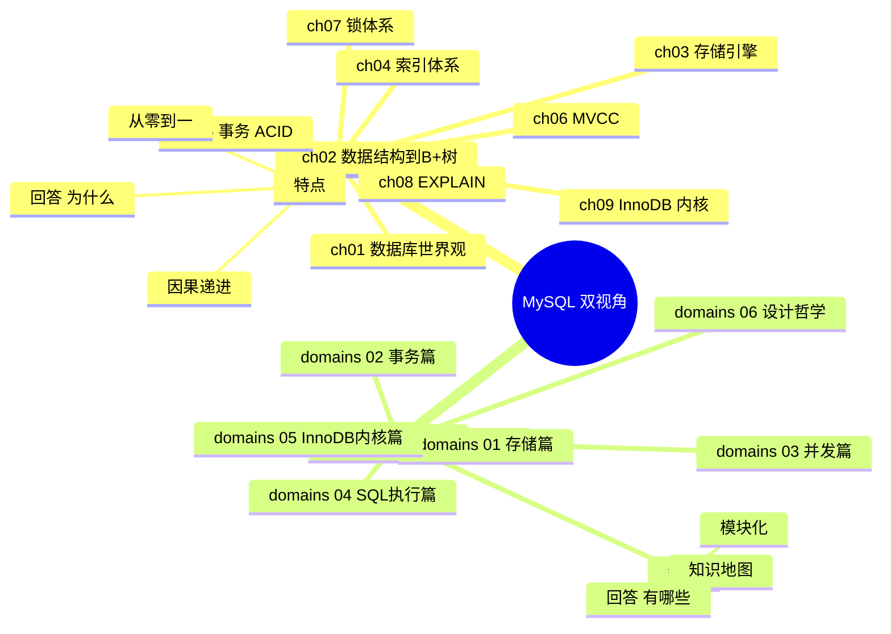

---

> 💡 以上思维导图均使用 Mermaid `mindmap` 语法，在支持 Mermaid 的 Markdown 渲染器（如 GitHub、Typora、VS Code 插件）中均可正常显示。
